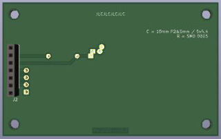

# freeDSP-aurora-extension-i2c-mod-display
PCB with startup delay (I2C) mod with a DM 2.4" OLED

*Instructions:*
- Move R4 to R3 position
- Set Jumper to R5 position
- Set Jumper to R7 position
- Solder only one C and one R!
- Use only plastic screws and stands!
! (GND plane on both sides) !

## Contributing

**Please take care on which branch you're currently working!**

Branches:

- *master* - this branch always holds the latest released revision
- *develop* - this is the develop branch with new features. Please base your patches on this branch.
